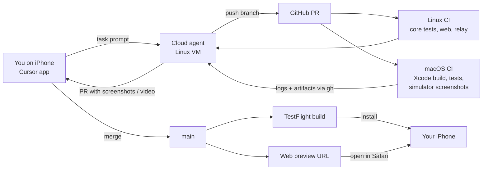
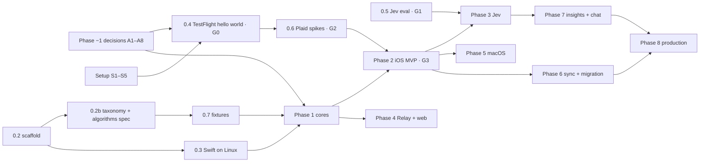

# Implementation plan: building the three clients with cloud agents

Status: **Proposal** · Last updated: 2026-09-29 · Design: [multi-client-design.md](./multi-client-design.md) · Decisions: [decisions.md](./decisions.md)

The plan assumes the recommended options in [decisions.md](./decisions.md). One-way decisions (A1–A8) gate specific tasks. Agents may start reversible work before sign-off but must not cross a gated step until you approve it (§5, "Phase −1").

This plan assumes:

- All code is written by **Cursor Cloud Agents** (Linux VMs).
- The owner directs work **only from an iPhone** (Cursor iOS app, Safari, GitHub, TestFlight). There is no Mac or laptop available for now.
- Every change must be verifiable without a local machine.

---

## 1. How the no-laptop loop works



**What the agent can verify alone vs. what needs you**

| Check | Who / where |
|-------|-------------|
| Swift core logic (`FinanceCore`) | Agent: `swift test` on Linux in its VM |
| TypeScript core, web app, Relay | Agent: `vitest`, Playwright, local servers in its VM |
| Web UI look & behavior | Agent: Playwright screenshots + screen-recorded demo in the PR |
| Relay against Plaid Sandbox | Agent: end-to-end script in its VM (needs Sandbox keys as secrets) |
| Jev evaluation | Agent: eval script in its VM (needs Jev key as a secret) |
| iOS/macOS compile, unit and UI tests | macOS CI runner; agent reads logs with `gh run view --log` and downloads artifacts with `gh run download` |
| iOS/macOS screens | macOS CI UI tests capture simulator screenshots in **demo-data mode**; the agent embeds them in the PR |
| Real-device feel, Face ID, Plaid Link on a phone | **You**, via TestFlight on your iPhone |
| macOS app hands-on | Deferred until a Mac is available; until then, CI screenshots only |

The code lives in the **private** repo `ScoopedOutStudios/finances-manager-apps` ([decisions.md](./decisions.md) A0). On private repos, GitHub-hosted macOS minutes are metered (they count about 10× against the plan's monthly allowance; check the org's current plan and pricing). Budget accordingly:

- Keep logic in the Swift package tested on **Linux** (cheap); run macOS jobs only for PRs touching `apps/apple`.
- Merge Apple PRs in batches so one TestFlight build covers several changes.
- If minutes run short: enable pay-as-you-go for Actions on the org, upgrade the org plan, or evaluate Xcode Cloud (25 compute hours/month included with Apple Developer membership; initial setup may require Xcode on a Mac).

---

## 2. One-time setup (your actions, all doable from iPhone)

Do these once; agents will pause and ask when one is needed. Most steps work in iPhone Safari (use "Request Desktop Website" for the developer portals).

| # | Action | Where | Needed by |
|---|--------|-------|-----------|
| S1 | Enroll in the **Apple Developer Program** ($99/yr). | Apple Developer app on iPhone | Phase 0.4 |
| S2 | Create an **App Store Connect API key** (role: App Manager). Download the `.p8` file once. Note the Key ID and Issuer ID. | appstoreconnect.apple.com → Users and Access → Integrations | Phase 0.4 |
| S3 | Create the app record (bundle ID proposed by the agent, e.g. `io.github.<you>.lfm`). | App Store Connect | Phase 0.4 |
| S4 | Add GitHub **Actions secrets**: `ASC_KEY_ID`, `ASC_ISSUER_ID`, `ASC_KEY_P8` (file contents), `APPLE_TEAM_ID`. | github.com → repo → Settings → Secrets (Safari desktop mode) | Phase 0.4 |
| S5 | Install **TestFlight** and accept the internal-tester invite. | App Store / email | Phase 0.4 |
| S6 | Add **Cursor Cloud Agent secrets**: `PLAID_CLIENT_ID`, `SANDBOX_PLAID_SECRET`, `TYPESAFE_API_KEY`, optionally `OPENAI_API_KEY` / `ANTHROPIC_API_KEY`. Also add the Plaid Sandbox values as GitHub Actions secrets for CI end-to-end tests. | Cursor Dashboard → Cloud Agents → Secrets | Phase 0.5–0.6 |
| S7 | Request **Jev early access** and create an API key. | typesafe.ai | Phase 0.5 |
| S8 | Create a **Vercel** account (or Cloudflare) for the Relay and web previews; connect the GitHub repo; add Relay env vars (Plaid Sandbox secret, relay key). | vercel.com | Phase 0.6 |
| S9 | In the Plaid Dashboard, add allowed redirect URIs / iOS bundle ID if the OAuth spike says they are needed. | dashboard.plaid.com | Phase 0.6 |

**Secret hygiene**: secrets only in Cursor/GitHub/Vercel secret stores, never in the repo (gitleaks CI already enforces this). Demo data and fixtures are synthetic. Production Plaid keys are entered by you **inside the app on your phone**, never given to agents.

---

## 3. Target repository layout

Clean slate ([decisions.md](./decisions.md) A0, B1): this is a new repo. The old public app is consulted as reference only; nothing is imported from it.

```
apps/
  apple/                 # SwiftUI multiplatform app (iOS + macOS)
    project.yml          # XcodeGen spec — the .xcodeproj is generated, never hand-edited
    Sources/App/…        # UI
    Tests/UITests/…      # UI tests that capture screenshots in demo mode
    fastlane/ or scripts/ # archive + TestFlight upload using the ASC API key
  web/                   # React + Vite PWA
packages/
  FinanceCore/           # Swift package: DB, sync, rules, transfers, recurring, budgets, classify
  core-ts/               # TypeScript equivalent (@lfm/core)
services/
  relay/                 # Stateless serverless Relay (Plaid + AI passthrough)
spec/
  schema.sql             # Shared SQLite schema + migrations
  taxonomy.json          # Categories, descriptions (also Jev criteria), colors, icons
  design-tokens.json     # Colors, type, spacing → generated Swift + CSS
  algorithms.md          # Written spec: mapping, transfers, recurring, rules, fingerprints, budgets
  fixtures/              # Golden input/expected-output JSON for both cores
tools/
  eval/                  # Classification evaluation harness
  import-legacy/         # merchant rules + budgets.yml from the old app → .lfmbackup
docs/
  design/                # These design docs (decisions, design, plan)
```

Key choice for agents without Xcode: **XcodeGen** (`project.yml`) keeps the Xcode project as reviewable text, so agents never need the Xcode GUI and merge conflicts in `.pbxproj` disappear.

---

## 4. CI/CD pipelines

| Workflow | Runner | Trigger | Steps |
|----------|--------|---------|-------|
| `secrets.yml` | Linux | push/PR | gitleaks scan of tracked files + history (carried over from the old repo's setup), SHA-pinned actions |
| `core.yml` | Linux | PR touching `packages/`, `spec/` | `swift test` for FinanceCore (Swift Linux container), `vitest` for core-ts, **both run `spec/fixtures`** |
| `web.yml` | Linux | PR touching `apps/web`, `packages/core-ts` | Typecheck, unit tests, Playwright (mobile + desktop viewports), upload screenshots; Vercel posts a preview URL |
| `relay.yml` | Linux | PR touching `services/relay` | Unit tests; Plaid Sandbox end-to-end (link token → sandbox public token → exchange → sync) |
| `apple.yml` | macOS | PR touching `apps/apple`, `packages/FinanceCore` | `xcodegen generate`, build iOS simulator + macOS, unit tests, UI tests in demo mode, upload `.xcresult` and PNG screenshots |
| `testflight.yml` | macOS | push to `main` touching Apple code, or manual | Archive with automatic signing via the ASC API key (`-allowProvisioningUpdates -authenticationKeyPath …`), build number = run number, upload to TestFlight, post the build number |

Useful conventions:

- **Demo-data mode** (`-demoData` launch argument / `?demo=1` on web) seeds the database from `spec/fixtures/demo.json`. It is used by all UI tests and screenshots, so no Plaid call is needed to render screens.
- The agent attaches screenshots/videos to every UI PR so you can review on your phone before merging.
- Pin GitHub Actions to commit SHAs (repo policy).

---

## 5. Phases and tasks

Each task below is sized for **one agent → one PR**. Tasks in the same "lane" run sequentially; different lanes can run in parallel agents. **Gates** are decision points where you review results before continuing.

### Phase −1 — Decision sign-off

You reply to [decisions.md](./decisions.md) A1–A8 (one line is enough). The agent records outcomes in the register's log. What each decision blocks:

| Decision | Blocks until approved | Can proceed before approval |
|----------|-----------------------|-----------------------------|
| A1 App identity | 0.4 (first TestFlight build), 6.1 (iCloud container) | Everything not touching Apple identifiers |
| A2 Stack | 0.4, Phase 1 cores, all app phases | 0.5 (eval harness is standalone), 0.6a (Relay spike) |
| A3 Distribution scope | 8.1 (production) | Everything else |
| A4 Taxonomy | 0.5 final labels, 1.3 cascade, anything storing categories | 0.2b drafts `taxonomy.json` **for your review** |
| A5 Real data to cloud AI | 3.2 enabling Jev on real data | 0.5 (synthetic + Sandbox only), 3.1 (built but off) |
| A6 Sync design | 6.1 | Everything else (change log table exists from 1.1 regardless) |
| A7 Plaid secret placement | 2.2 default transport | Both transports can be built |
| A8 Bank data provider | 1.2 provider adapter | Provider interface design |

### Phase 0 — Foundations and spikes

| ID | Task | Lane | Acceptance (verifiable from iPhone) |
|----|------|------|-------------------------------------|
| 0.1 | You complete setup S1–S5 (S6–S9 can follow). | You | Secrets present. |
| 0.2 | Bootstrap the new repo: copy these design docs into `docs/design/`, add README, AGENTS.md, `.gitignore`, gitleaks config + pre-commit hook + `secrets.yml`, scaffold the layout in §3 (empty packages build), npm workspaces for TS, `spec/schema.sql` v1. | A | CI green; PR shows tree. |
| 0.2b | Draft `spec/taxonomy.json` (~14 groups / ~70 categories, slugs, labels, descriptions written for Jev, icons, colors, Plaid-category mapping) and `spec/algorithms.md`. | A | **You approve the taxonomy (A4)** from a readable table in the PR. |
| 0.3 | Agent environment: add the Swift Linux toolchain + SQLite to the Cloud Agent environment so agents can run `swift test`. | A | Agent PR shows `swift test` output from its VM. |
| 0.4 | **No-laptop loop proof**: hello-world SwiftUI multiplatform app via XcodeGen; `apple.yml` builds and captures one screenshot; `testflight.yml` uploads. | B | **Gate G0**: you install the hello-world build from TestFlight on your iPhone. |
| 0.5 | **Jev evaluation harness** (`tools/eval`): labeled synthetic dataset (~400 descriptors), Plaid Sandbox transactions, contenders (Plaid category mapped to our taxonomy, Jev ± bank hint, Jev + roll-up, LLM structured output), metrics (accuracy, coverage at 95% precision, calibration, latency, cost). Report as markdown in the PR. | C | **Gate G1**: you read the report and choose policy P1/P2 or "no Jev" (design §8.4, §8.6). |
| 0.6 | **Plaid spikes**: (a) minimal Relay deployed to Vercel preview with Sandbox; (b) LinkKit in the hello-world iOS app linking the Sandbox OAuth test institution; (c) Hosted Link + `/link/token/get` feasibility note for macOS. | D (after 0.4 for b) | **Gate G2**: you link a Sandbox bank (`user_good` / `pass_good`) inside the TestFlight build. |
| 0.7 | **Golden fixtures** authored from `spec/algorithms.md` (provider mapping, transfers, recurring, rules, fingerprint re-attachment, budgets, effective category). Legacy modules consulted only to spot cases worth covering. | A | Fixture files reviewed in PR; CI validates their format. |

### Phase 1 — Shared spec and cores (lanes run in parallel)

| ID | Task | Lane | Acceptance |
|----|------|------|------------|
| 1.1 | FinanceCore: SQLite (GRDB) migrations from `schema.sql`, repositories, `v_txn_effective`. | A | `swift test` green on Linux. |
| 1.2 | FinanceCore: `BankDataProvider` interface + Plaid adapter with Direct/Relay transports (added/modified/removed, cursor, pending→posted, soft-delete, sign flip to integer cents, fingerprints), with a mock transport and recorded Sandbox responses. | A | Tests replay recorded Sandbox pages. |
| 1.3 | FinanceCore: rules, transfers, recurring, budgets, classification cascade (stages 1–4, 6–7; Jev stubbed). | A | Passes `spec/fixtures`. |
| 1.4 | core-ts: same as 1.1–1.3 for SQLite-WASM (tests in Node). | E | Passes the same fixtures. |
| 1.5 | `design-tokens.json` → generated Swift + CSS; category icon/color map. | F | Generated files committed; preview image of palette. |

### Phase 2 — iOS MVP (Direct mode, Sandbox)

| ID | Task | Acceptance |
|----|------|------------|
| 2.1 | App shell: tab bar, demo-data mode, database bootstrapping, Settings skeleton. | Screenshots of every tab in the PR. |
| 2.2 | Accounts: connection settings (Direct mode keys in Keychain, Sandbox/Production switch), LinkKit linking, item list, remove item. | TestFlight: link Sandbox bank. |
| 2.3 | Sync: Sync button, pull-to-refresh, progress, "last synced", error states, offline state. | TestFlight: sync; airplane mode still browses. |
| 2.4 | Transactions list + search + filters + detail sheet with category picker, "always use for merchant" rule, notes. | Screenshots + TestFlight. |
| 2.5 | Review inbox (manual suggestions from the cascade for now). | Screenshots + TestFlight. |
| 2.6 | Overview + Budgets (in-app budget editor, month switcher, drill-down chart). | Screenshots + TestFlight. |
| 2.7 | Privacy: Face ID lock, app-switcher redaction, wipe data. | TestFlight. |

**Gate G3**: you use the iOS app with Sandbox data for a few days and file feedback as GitHub issues (or just tell the agent in Cursor).

### Phase 3 — Classification with Jev (shape depends on G1)

| ID | Task | Acceptance |
|----|------|------------|
| 3.1 | `JevClassifier` in Swift and TS: fan-out request, `OTHER` option, minimized payload, pinned version, retries honoring `retry-after`, concurrency limit. | Unit tests with recorded responses; live smoke in agent VM. |
| 3.2 | Thresholds, roll-up, review routing; shadow mode (log only) behind a setting. Real data is sent only after A5 approval and in-app opt-in. | Review inbox shows top-3 alternatives with confidence. |
| 3.3 | AI settings: provider switch, BYO key, thresholds preset, "What gets sent" preview, usage/cost. | Screenshots + TestFlight. |
| 3.4 | On-device evaluation card: accuracy of each source vs. your accepted categories, computed locally. | TestFlight after a week of reviews. |
| 3.5 | (Optional) Apple Foundation Models offline provider, evaluated with the harness. | Eval report comparison. |
| 3.6 | Custom categories editor (create, rename, archive, edit descriptions that feed Jev criteria). | TestFlight. |

### Phase 4 — Relay + web client

| ID | Task | Acceptance |
|----|------|------------|
| 4.1 | Relay hardening: relay-key auth, rate limits, no body logging, allow-listed Jev question shapes, LLM streaming passthrough. | Sandbox end-to-end in CI. |
| 4.2 | Web shell (PWA, SQLite-WASM/OPFS, demo mode, responsive layout). | Vercel preview opens on your iPhone in Safari; add to Home Screen works. |
| 4.3 | Web: link + sync via Relay, transactions, detail, review, budgets (reusing core-ts). | Playwright video in PR; you try the preview on your phone. |
| 4.4 | Web: optional passphrase encryption, persistent-storage request, backup/restore. | Tests + screenshots. |
| 4.5 | iOS/macOS: optional Relay mode transport. | TestFlight toggle works. |

### Phase 5 — macOS

| ID | Task | Acceptance |
|----|------|------------|
| 5.1 | macOS target polish: `NavigationSplitView`, `Table` with multi-select and bulk recategorize, inspector, keyboard shortcuts, Settings window. | macOS CI screenshots. |
| 5.2 | Hosted Link flow for macOS. | macOS CI UI test with a Sandbox mock; hands-on later. |
| 5.3 | Menu bar extra (optional). | Screenshots. |

Hands-on macOS validation waits until a Mac is available (TestFlight for macOS or a direct build).

### Phase 6 — Cross-device and migration

| ID | Task | Acceptance |
|----|------|------------|
| 6.1 | Encrypted change-log sync over CloudKit (one generic `ChangeEntry` record type, payload in `encryptedValues`, hybrid-logical-clock last-writer-wins, snapshots). Schema stays in the CloudKit development environment until you approve promotion to production (permanent). Requires the iCloud capability on the App ID (agent provides exact steps; you click through in the developer portal). | Two TestFlight installs (iPhone + iPad, or later Mac) converge. |
| 6.2 | Optional iCloud Keychain sync for Plaid access tokens. | Second device syncs without re-linking. |
| 6.3 | `.lfmbackup` format (Swift + TS), import/export UI. | Round-trip test in both cores. |
| 6.4 | `tools/import-legacy`: merchant rules from `.data/category-overrides.json` + `budgets.yml` → `.lfmbackup`, mapped onto the new taxonomy (run later on your Mac). | Tested with synthetic legacy files. |

### Phase 7 — Insights and AI chat

| ID | Task | Acceptance |
|----|------|------------|
| 7.1 | Recurring & subscriptions, trends, top merchants (local SQL). | Screenshots + TestFlight. |
| 7.2 | Jev intent router → canned parameterized SQL (answers common questions without an LLM). | Eval on a question set; TestFlight. |
| 7.3 | LLM chat with on-device read-only SQL tool, "Show work" disclosure, BYO key or Relay. | TestFlight. |
| 7.4 | Briefings (weekly), numbers from SQL. | TestFlight. |

### Phase 8 — Production and cleanup

| ID | Task | Acceptance |
|----|------|------------|
| 8.1 | Production readiness checklist: Plaid Production keys entered by you in-app, OAuth institutions verified, backup nudges. | **Gate G4**: you link a real bank on your phone. |
| 8.2 | Investments port (holdings, CSV import) to the new clients. | TestFlight. |
| 8.3 | Update README, AGENTS.md, and runbooks for the new clients; add a pointer from the old public repo's README to the new apps if desired. | CI green; docs updated. |

---

## 6. Critical path and parallelism



- **Before sign-off**, 0.2, 0.2b, 0.3, 0.5, and 0.6a can start; none of them commits to a one-way door.
- **Right after A1 + A2 are approved**, start 0.4: G0 (can you ship to your phone without a Mac) and G1 (is Jev good enough) are the two biggest unknowns.
- After Phase 1, the **iOS lane** (Phase 2) and the **web lane** (Phase 4) proceed in parallel.
- Keep at most two or three agents touching `apps/apple` at once to limit `project.yml` and UI merge conflicts.

---

## 7. Directing agents from the Cursor iOS app

**Backlog**: the agent in task 0.2 can draft every task above as a GitHub issue body in a PR (as markdown under `tools/` or in the PR description) for you to paste into issues, since agents have read-only GitHub CLI access. Then you start each task with a short prompt that references the issue.

**Prompt template** (paste into a new cloud agent):

```
Implement task <ID> from docs/design/implementation-plan.md
(issue #<n>). Follow the design in docs/design/multi-client-design.md
and approved decisions in docs/design/decisions.md. If the task would
cross an unapproved one-way door, stop and ask me instead.
Definition of done: CI green; for UI work attach demo-mode
screenshots (and a video for web) to the PR; list anything I must
do on my phone to validate. Do not ask for production Plaid keys.
```

**Review checklist on your phone**

1. PR description: what changed, screenshots/video, "How to validate".
2. CI checks green (ask the agent to investigate any red check).
3. For Apple changes: after merge, open TestFlight and install the new build number posted in the PR.
4. Reply in the Cursor app with feedback; the same agent iterates on the branch.

---

## 8. Risks specific to the build process

| Risk | Mitigation |
|------|------------|
| Automatic signing via API key fails in CI | Fallback to fastlane `match` with certificates in a private repo; the agent documents the switch. |
| macOS CI is slow (UI tests + archive can exceed 15 min) | Keep logic in `FinanceCore` (tested on Linux); run UI tests only on PRs touching `apps/apple`; cache SPM. |
| Agents can't see the simulator live | Demo-mode screenshots in every UI PR; `.xcresult` attachments; snapshot tests for key screens. |
| Plaid Link can't be automated in UI tests | Mock transport in UI tests; real Link verified by you via TestFlight (Sandbox). |
| Jev access delayed | Phases 1–2 do not depend on Jev; the harness runs other contenders meanwhile. |
| Secrets or personal data committed | Private repo, plus gitleaks CI + pre-commit hook from day one; fixtures and screenshots use synthetic data; production keys only enter the app on your device. Keeps the option to open-source later with a clean history. |
| macOS CI minutes run out (private repo) | Linux-first testing, path-filtered macOS jobs, batched TestFlight builds, pay-as-you-go or Xcode Cloud as fallback. |
