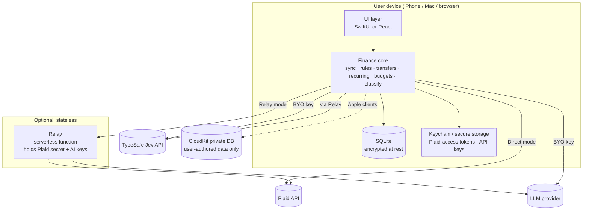
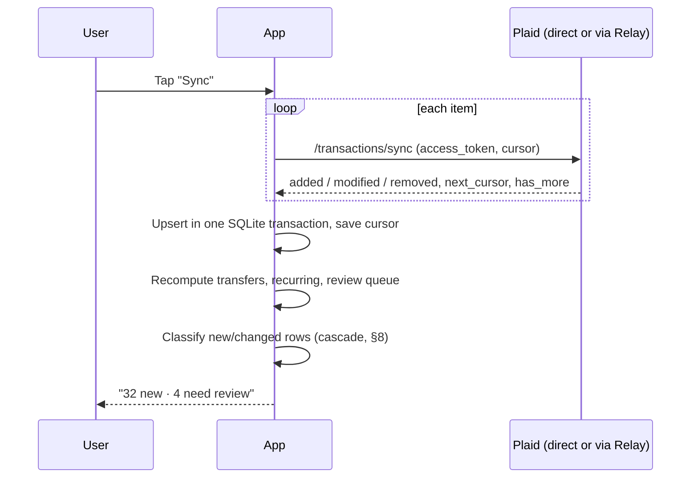

# Multi-client design: web, macOS, iOS

Status: **Proposal** · Last updated: 2026-09-29 · Companion: [implementation-plan.md](./implementation-plan.md)

This document proposes how to evolve local-finances-manager from a single local Node/Express server + browser UI into three clients: **web**, **native macOS**, and **native iOS**. It keeps the product's core promise: financial data lives on the user's device, works offline, and is refreshed from Plaid only when the user asks.

It also evaluates **Jev** (TypeSafe AI's "System One" decision model) as the transaction classifier.

---

## 0. Decisions at a glance

| # | Decision | Recommendation |
|---|----------|----------------|
| D1 | Where data lives | On-device **SQLite**, one shared schema across all three clients. |
| D2 | Backend | **No backend holds user data.** An optional, stateless **Relay** exists only to hold secrets that must not ship in a client. |
| D3 | Plaid on native | Two modes. **Direct mode** (default for personal builds): the app calls Plaid itself using the user's own keys kept in Keychain. **Relay mode**: the Relay holds the Plaid secret. Web always uses Relay mode. |
| D4 | Cross-device | Transactions are **not** synced between devices; each device pulls from Plaid on demand. Only **user-authored data** (rules, overrides, budgets, custom categories) syncs, through **CloudKit private database with encrypted fields**. |
| D5 | Shared logic | Two native-language implementations (**Swift** for Apple, **TypeScript** for web) held to one spec: shared SQL schema, taxonomy file, and **golden test fixtures** generated from today's TypeScript code. |
| D6 | Apple UI | One **SwiftUI multiplatform** app (iOS + macOS targets), with platform-specific navigation. |
| D7 | Web UI | Static **PWA** (React + Vite), SQLite-WASM persisted in OPFS, installable on iPhone home screen. |
| D8 | Classification | A **cascade**: rules → the user's own history → Plaid category (as a signal) → **Jev** → human review. **No LLM in the classification path by default**; add one only if the evaluation shows a quality gap Jev cannot close. |
| D9 | Other AI (chat, briefings) | Stays LLM-based (text generation is required). Numbers still come from local SQL, never from the model. |
| D10 | AI keys | Bring-your-own keys in Keychain (native, no backend) **or** routed through the Relay / Vercel AI Gateway (required for web). |

---

## 1. Goals, non-goals, constraints

**Goals**

- Three clients with feature parity on the core loop: link accounts → sync on demand → see and fix categories → track budgets → understand spending.
- Native apps are fully self-sufficient: they work with **zero servers** operated by the project.
- Offline-first: every read path works in airplane mode. Only "Sync now", linking, and AI calls need a network.
- Classification quality that improves from the user's corrections, with confidence the user can see.
- Buildable end-to-end by cloud agents, validated from an iPhone (see the implementation plan).

**Non-goals**

- Multi-user accounts, sharing, or a hosted SaaS.
- Server-side storage of transactions, tokens, or derived data.
- Background auto-sync by default (it remains opt-in later, if ever).

**Hard constraints discovered during design**

1. **Plaid requires a server-side secret.** `/link/token/create`, `/item/public_token/exchange`, and `/transactions/sync` all need `client_id` + `secret`. Plaid's guidance is that the secret must never ship inside a distributed client, and the Plaid API does not allow browser (CORS) calls. This is the single biggest force on the architecture (see §4).
2. **Jev is cloud-only.** No weights, no on-device option, US data processing, no zero-retention outside enterprise plans, no fine-tuning. Early access at launch (Sept 2026).
3. **The builder has no Mac right now.** Anything that requires Xcode must be driven through CI on macOS runners (see the implementation plan).

---

## 2. Current state (what we are migrating from)

| Concern | Today |
|---------|-------|
| Server | Express (`src/server.ts`, ~3k lines) serving `public/index.html` (single-file UI, ~3.5k lines). |
| Plaid | `src/plaid-client.ts`: link token, token exchange, `transactions/get` for history, `transactions/sync` for refresh, investments. |
| Storage | JSON files in `.data/` (`plaid-session.json` with every transaction embedded; `category-overrides.json`); access tokens in macOS Keychain (`src/keychain.ts`). |
| Analytics | TSV exports in `exports/`, queried by DuckDB (`src/query.ts`) for briefings, recurring detection, and LLM chat tool-use. |
| Classification | Plaid PFC categories. `src/category-review.ts` sends only LOW/MEDIUM-confidence, non-transfer transactions to an LLM in batches of 200; flagged items go to a review queue. Merchant rules (`src/override-store.ts`) match on entity ID, name, and description similarity. |
| Derived logic | Transfer pairing (`src/transfers.ts`, ±3 days, ±$0.02), recurring streams (SQL in `src/query.ts`), budget review (`src/budget-targets.ts` from `context/budgets.yml`). |

What carries over conceptually: the Plaid sync model (cursor-based `transactions/sync`), the override/rule precedence, transfer and recurring algorithms, budget semantics, and the principle that "the LLM narrates, SQL computes."

What changes: JSON blobs → SQLite; TSV/DuckDB → SQL views over the same database; the server stops being mandatory.

---

## 3. Architecture overview



**Layers inside each client**

| Layer | Apple (Swift) | Web (TypeScript) |
|-------|---------------|------------------|
| UI | SwiftUI; `NavigationSplitView` on macOS, `TabView` on iOS | React + Vite PWA |
| Core | `FinanceCore` Swift package: pure Swift, no UIKit/AppKit, **builds and tests on Linux** | `@lfm/core` TS package: pure TS, runs in Node for tests |
| Persistence | SQLite via GRDB | SQLite-WASM (official build) with the OPFS SAH-pool VFS |
| Secrets | Keychain (`kSecAttrAccessibleWhenUnlockedThisDeviceOnly`, optional iCloud Keychain sync) | Nothing long-lived; the Relay holds secrets and issues a session |
| Networking | `PlaidTransport` protocol: `DirectPlaidTransport` or `RelayPlaidTransport` | `RelayPlaidTransport` only |

---

## 4. The backend question

The goal is "native apps need no backend." Here is what that costs and what we recommend.

### 4.1 What actually needs a server

| Capability | Needs a secret? | Can a native app do it alone? | Can a browser do it alone? |
|------------|-----------------|-------------------------------|----------------------------|
| Read/write local data, analytics, budgets | No | Yes | Yes |
| Plaid Link UI | Needs a `link_token` (created with the secret) | Only if the secret is on the device | No |
| Token exchange, `/transactions/sync`, balances | Yes (secret) | Only if the secret is on the device | No (secret + no CORS) |
| Jev classification | Jev API key | Yes, with a BYO key | Unverified; the official JS SDK is server-only by default. Assume no. |
| LLM chat / briefings | Provider key | Yes, with a BYO key | Some providers allow browser calls, but it exposes the key |
| Cross-device sync of user edits | — | Yes, with CloudKit | No CloudKit encrypted fields from the web |

### 4.2 Recommendation: two transport modes

**Direct mode (native default for personal builds).** The user enters their own Plaid `client_id` + `secret` (and optionally Jev/LLM keys) in Settings. They are stored in Keychain behind Face ID / Touch ID. The app calls `production.plaid.com` / `sandbox.plaid.com` directly.

- Pros: truly zero backend, matches today's model where every user already brings their own Plaid keys, nothing to deploy or pay for.
- Cons: goes against Plaid's guidance for *distributed* apps. For a personal build where the user's own key lives on the user's own device, the blast radius is the user's own Plaid account. **Not acceptable for an App Store build distributed to other people**; that build must use Relay mode.

**Relay mode (web always; native optional).** A single stateless serverless function (Vercel Functions or Cloudflare Workers) holds the Plaid secret and AI keys:

```
POST /v1/plaid/link-token        -> { link_token }
POST /v1/plaid/exchange          -> { access_token, item_id }   // returned to client, not stored
POST /v1/plaid/sync              <- { access_token, cursor }    -> Plaid sync page(s)
POST /v1/plaid/accounts          <- { access_token }            -> balances
POST /v1/ai/decide               -> Jev passthrough (allow-listed question shapes)
POST /v1/ai/chat                 -> LLM streaming passthrough
```

Relay rules:

- **Stores nothing.** No database, no body logging, no analytics on payloads. Access tokens stay on the client and are sent per request over TLS.
- **Single-user auth.** A long random relay key, generated at setup and stored in the client's Keychain / browser credential store, plus optional passkey auth for web. Per-key rate limits.
- **Tiny.** It reuses `src/plaid-client.ts` almost unchanged. Today's Express server effectively becomes the Relay once storage and UI move out.
- Can be self-hosted by the user (their own Vercel account); the project never operates a shared instance.

### 4.3 Plaid Link specifics per platform (verify during Phase 0 spikes)

| Platform | Link integration | Notes |
|----------|------------------|-------|
| iOS | Plaid **LinkKit** (Swift Package) | OAuth institutions may require a registered HTTPS redirect / universal link. If so, host `apple-app-site-association` as a static file on the web client's domain; no compute needed. |
| macOS | **Hosted Link** in `ASWebAuthenticationSession`, then `/link/token/get` to retrieve the `public_token` (polling, no webhook) | LinkKit targets iOS. Fallback: run the iPad build on Apple-silicon Macs. |
| Web | Plaid Link JS (`link-initialize.js`) | Link token always comes from the Relay. |

### 4.4 Where a backend *would* earn its keep later

Only if these become goals: webhook-driven background sync (Plaid `SYNC_UPDATES_AVAILABLE`), push notifications for large transactions, or distributing to other users. All three are out of scope for v1.

---

## 5. Data storage

### 5.1 Why SQLite everywhere

- One schema, one set of SQL views, and one golden-fixture suite across Swift and TypeScript.
- Personal scale is small: 10 years × ~3k transactions/year ≈ 30k rows. SQLite handles aggregation at this size in milliseconds, so DuckDB's columnar engine is unnecessary (and its Swift/WASM binaries are large).
- Mature on every target: system SQLite / GRDB on Apple, official SQLite-WASM with OPFS on the web.
- The LLM chat tool keeps working: it targets a **read-only connection** over SQL views instead of `read_csv_auto(TSV)`.

SwiftData was considered and rejected: its schema is Swift-only, SQL analytics are awkward, and schema migration is less controllable.

### 5.2 Schema (shared `spec/schema.sql`)

```sql
-- Plaid-sourced (re-derivable by re-syncing)
items(item_id PK, institution_id, institution_name, cursor, status,
      last_sync_at, last_sync_error, created_at)
accounts(account_id PK, item_id FK, name, official_name, mask, type, subtype,
         balance_available, balance_current, iso_currency, balances_at)
transactions(txn_id PK, account_id FK, item_id FK, date, authorized_date,
             name, merchant_name, merchant_entity_id, amount, iso_currency,
             pending, pending_txn_id, payment_channel,
             plaid_pfc_primary, plaid_pfc_detailed, plaid_pfc_confidence,
             counterparties_json, location_json, logo_url, website,
             removed_at, first_seen_at, updated_at)

-- Classification (append-only decision log)
classifications(id PK, txn_id FK, source,      -- rule|override|memory|plaid|jev|llm|on_device|user
                primary_cat, detailed_cat, confidence,
                alternatives_json, model_version, created_at)

-- User-authored (synced across Apple devices via CloudKit)
categories(cat_id PK, parent_id, label, description, pfc_mapping, is_custom, sort)
merchant_rules(rule_id PK, merchant_entity_id, merchant_name_norm,
               match_description, detailed_cat, created_at, updated_at)
txn_overrides(txn_id PK, detailed_cat, note, tags_json, updated_at)
budgets(budget_id PK, cat_id, amount, cadence, effective_start, effective_end, note)
settings(key PK, value_json)

-- Derived (recomputed after each sync; never synced)
transfer_pairs(txn_id PK, pair_txn_id, kind)   -- internal_transfer | cc_payment
recurring_streams(stream_key PK, ..., is_active, frequency, avg_amount)
review_queue(txn_id PK, reason, suggested_cat, confidence, alternatives_json)

-- Observability
ai_calls(id PK, provider, purpose, input_tokens, cost_usd, latency_ms, created_at)
eval_results(run_id, txn_id, truth_cat, predicted_cat, confidence, source)
```

A view `v_txn_effective` resolves the final category with explicit precedence: **user override → merchant rule → accepted AI suggestion → Plaid** (same order as today), and joins transfer flags. Budgets, charts, exports, and the chat tool all read from this view.

Keep raw Plaid JSON out of the main table (store only mapped columns) to limit what sits on disk.

### 5.3 Security at rest

| Platform | Measure |
|----------|---------|
| iOS | Database in the app container with `NSFileProtectionComplete`; Keychain items `WhenUnlockedThisDeviceOnly`; optional app lock with Face ID; screenshot blurring in the app switcher. |
| macOS | App Sandbox container; Keychain; optional SQLCipher if the user wants protection beyond FileVault. |
| Web | OPFS is origin-scoped but **not encrypted**. Offer an optional passphrase that derives a key (WebCrypto PBKDF2/Argon2-WASM) to encrypt the database file at rest. Show a clear notice that the browser is the weakest client. |

### 5.4 Data lifecycle

- **Export**: portable, encrypted `.lfmbackup` file (SQLite + manifest, AES-GCM with a passphrase). Also TSV/CSV exports matching today's report types.
- **Wipe**: one action deletes the database, Keychain items, and calls Plaid `/item/remove` (optional).
- **Removed transactions**: honor Plaid `removed` by setting `removed_at` (soft delete keeps any overrides auditable), and hide them in views.

---

## 6. Sync model

### 6.1 Plaid: pull on demand only



- First link: `/transactions/sync` from an empty cursor returns the full available history (up to `days_requested`, 730 max), replacing today's `transactions/get` backfill.
- Balances: `/accounts/get` (cached) on sync; `/accounts/balance/get` only on explicit "refresh balance" because it costs more.
- Pending → posted: link through `pending_transaction_id` so overrides carry over.
- Offline: the Sync button is disabled with a "last synced 2h ago" label; everything else works.

### 6.2 Across devices

| Data | Syncs? | How |
|------|--------|-----|
| Transactions, accounts, balances | **No** (default) | Each device syncs from Plaid independently. Cursors are per device. Plaid bills per Item, not per call, so this adds no cost. |
| Plaid access tokens | Optional | iCloud Keychain (`kSecAttrSynchronizable`) so the Mac can sync items linked on the iPhone without re-linking. |
| Rules, overrides, budgets, categories, settings | **Yes** | CloudKit private database, custom zone, all payload fields in `encryptedValues` (end-to-end encrypted). Conflict rule: last-writer-wins per record using `updated_at`. |
| Web ↔ Apple | Manual | Encrypted `.lfmbackup` import/export (e.g. via iCloud Drive / Files). |

Option (not default): also sync transactions through CloudKit encrypted fields, for users who want one device to be the only one talking to Plaid.

---

## 7. Sharing logic across three clients

| Option | Verdict |
|--------|---------|
| **A. Swift + TypeScript implementations, one spec + golden fixtures** | **Recommended.** Logic is small (transfers ~250 LOC, recurring ~150, rules ~200, budgets ~500). Each side stays idiomatic. Swift core builds on Linux, so cloud agents can test it without a Mac. |
| B. Rust core via UniFFI (Swift) + wasm-bindgen (web) | Single source, but adds a third language, FFI build complexity on macOS CI, and slower agent iteration. Revisit only if logic grows substantially. |
| C. TypeScript core run in JavaScriptCore on Apple | Awkward debugging, poor typing across the bridge, fights the platform. |

**Conformance suite (`spec/fixtures/`)**: JSON inputs (synthetic transactions) and expected outputs for transfer pairing, recurring detection, rule matching (including the 0.45 description-similarity threshold), budget math, and effective-category resolution. **Generate the first expected outputs by running today's TypeScript modules**, so the current behavior is the oracle. Both `swift test` and `vitest` must pass the same fixtures in CI.

---

## 8. Classification design, and a critical look at Jev

### 8.1 What Jev is (as of Sept 2026)

- A "System One" decision model from TypeSafe AI. It does **not** generate text. For each question it returns a typed answer: `choice` (one of your options + a probability for every option + a confidence), `score` (ordered levels), or `noul` (probability of yes).
- API: `POST https://api.typesafe.ai/v1/systemone` with `{ model, state, questions }`. Version pinning (`jev-1.13.0`) is supported.
- Limits: up to 255 options per choice question (about 240 recommended); 64k tokens per request, 32k for state plus the longest question; 1,200 requests/min.
- Price: $0.042 per million input tokens; output is free. Vendor latency: 70–500 ms.
- Data: US processing, no training on customer data, retention unspecified, zero-retention only for enterprise. Early access / waitlist at launch. Vercel AI Gateway added Jev support on 2026-09-21.

### 8.2 Fit for this problem

| Property of our task | Jev fit |
|----------------------|---------|
| Closed taxonomy: Plaid PFC has 16 primaries and roughly 100+ detailed categories | **Good.** Fits in one choice question, or in a primary + detailed "fan-out" within one request. |
| Short, cryptic text (`SQ *BLUE BOTTLE 0423 OAKLAND CA`) that needs world knowledge about merchants | **Probably good, unproven.** This is semantic recognition, not arithmetic. |
| Must never invent a category | **Strong.** Output is always one of our options. |
| Need confidence to decide auto-accept vs review | **Strong on paper.** Calibration is vendor-claimed, not independently published. We must measure it ourselves. |
| Amounts, dates, and transfer matching | **Poor.** TypeSafe says Jev is not a calculator. Keep these in code (already the case). |
| Wants to learn from corrections | **No fine-tuning.** Learning has to come from rules, the user's own history, and sharper category descriptions. |
| Explanations for the reviewer | **None.** Today's review shows LLM reasoning; with Jev we show confidence + top alternatives instead. In a one-tap review flow this is arguably better. |
| Privacy / local-first | **Weakest point.** Every classified transaction's text leaves the device to a young US vendor with unspecified retention. The same is already true of today's LLM review, but it must be opt-in, minimized, and visible. |
| Offline | **None.** Needs a fallback. |
| Cost at personal scale | **Negligible.** ~4k tokens per call with described options → about $0.0002 per transaction; a 5,000-transaction backfill is about $1. |
| Vendor risk | **Real.** Launched this month, waitlist, dynamic rate limits. Must be behind an interface with fallbacks. |

Published evidence is mixed: on TypeSafe's own 711-case dashboard (scored against GPT/Claude reference labels, not ground truth) Jev averaged 67.8% agreement vs 74.1% for the best LLM, while being about 100× cheaper and about 50× faster. It was close on routing-like tasks (customer service 76.0% vs 78.3%) and far behind on invoice processing (61.8% vs 79.1%). Transaction categorization is closer to routing than to invoice extraction, which is encouraging but not proof.

**Conclusion:** Jev is a strong candidate for the classifier **if it beats Plaid's own category on the user's data** at the confidence thresholds we choose. Treat that as a gate to measure in Phase 0, not as an assumption. **Plaid's PFC is the real baseline to beat, not an LLM.** Plaid already assigns a category and confidence to every transaction for free, and it is usually right when it says HIGH/VERY_HIGH.

### 8.3 Do we need an LLM alongside Jev?

For classification: **probably not.**

- The escalation target for low-confidence cases should be **the user**, not a bigger model. Personal volume is tiny (tens of reviews per week), the user is ground truth, and every answer becomes a rule that removes future work.
- An LLM escalation step adds cost, latency, a second vendor receiving the data, and non-determinism, in exchange for maybe a few more auto-accepted rows.
- **Re-open this only if** the Phase 0 evaluation shows the "roll up to primary / send to review" band is large (say >15% of new transactions) *and* an LLM resolves a meaningful share of it correctly.

LLMs remain the right tool for **chat and briefings**, which must produce language (§9).

### 8.4 The classification cascade

Every new or modified transaction goes through the stages in order; the first confident answer wins, and all decisions are logged to `classifications`.

| # | Stage | Where it runs | Output |
|---|-------|---------------|--------|
| 1 | **User override** on this transaction | Local | Final |
| 2 | **Merchant rule** (entity ID / normalized name / description similarity, as today) | Local | Final |
| 3 | **Personal memory**: the user previously confirmed a category for this normalized merchant key ≥ 2 times with no conflicts | Local | Final (confidence 0.99) |
| 4 | **Transfer / card-payment detection** (code, §2) | Local | Tags `is_internal_transfer`; excluded from spend |
| 5 | **Jev** (if enabled and online) | Cloud | Choice + confidence + alternatives |
| 6 | **Offline fallback**: on-device model (Apple Foundation Models on supported hardware) or Plaid's category, marked "unverified" and queued for Jev on the next online sync | Local | Provisional |
| 7 | **Review queue** | UI | User decides, can create a rule |

Where Plaid's category enters: it is always stored, is the effective category until a better decision exists, and is **passed to Jev as a hint** in one of two A/B variants (see 8.6).

**Two policies to choose between after evaluation:**

- **P1 — Gap filler.** Jev only sees transactions where Plaid confidence is below HIGH. Least data leaves the device. Similar to today's LLM review scope.
- **P2 — Primary classifier.** Jev classifies every transaction not already decided by stages 1–3. Required if the user wants **custom categories** (e.g. "Kids", "Work reimbursable", "Coffee" split from "Restaurants") because Plaid does not know them. Plaid–Jev disagreement at high confidence becomes a review signal.

Recommendation: ship with **P2 in shadow mode** (compute, don't apply) during evaluation, then pick based on measured results. Custom categories are the most compelling reason to put Jev in the product at all.

### 8.5 Jev request design

One request per transaction (batching several transactions in one state repeats the option list per question, so it saves no tokens). Parallelism of about 8 requests stays well under the rate limit; a 1,500-transaction backfill finishes in about two minutes.

```json
{
  "model": "jev-1.13.0",
  "state": {
    "merchant": "Blue Bottle Coffee",
    "description": "SQ *BLUE BOTTLE 0423 OAKLAND CA",
    "channel": "in store",
    "direction": "outflow",
    "amount_band": "under $20",
    "counterparty_type": "merchant",
    "bank_suggestion": "FOOD_AND_DRINK_COFFEE (low confidence)"
  },
  "questions": {
    "primary": {
      "type": "choice",
      "instructions": "Which spending category best describes this bank transaction?",
      "criteria": { "FOOD_AND_DRINK": "Restaurants, cafes, groceries, bars", "...": "...", "OTHER": "None of these fit" }
    },
    "detailed_FOOD_AND_DRINK": {
      "type": "choice",
      "instructions": "Assuming this is food and drink, which subcategory?",
      "criteria": { "FOOD_AND_DRINK_COFFEE": "Coffee shops and cafes", "...": "..." }
    }
  }
}
```

- **Speculative fan-out**: ask the primary question plus every primary's detailed question in the same request, then keep the detailed answer that matches the chosen primary. One round trip gives both levels and enables roll-up.
- **Always include an `OTHER` option** so "none fit" is a routable answer instead of a confident wrong one.
- **Data minimization**: no account IDs, account names, exact amounts, dates, or locations beyond city. Amount is bucketed (Jev is weak with numbers anyway). The Settings screen shows the exact payload for any transaction.
- **Personalization without fine-tuning**: user-edited category descriptions go straight into `criteria` (for example "Groceries: supermarkets **including Costco**"). Corrections that reveal a confusing boundary should be fixed by editing descriptions.
- **Pin the model version**; re-run the evaluation before moving to a new version.

**Decision thresholds** (starting values, tuned by the evaluation):

| Detailed confidence | Action |
|---------------------|--------|
| ≥ 0.90 | Auto-accept detailed category |
| 0.60–0.90, primary ≥ 0.90 | Accept the **primary** (roll up); mark "refine?" (low-priority review) |
| Otherwise, or `OTHER` chosen | Review queue with top-3 alternatives |

### 8.6 Evaluation harness (the gate)

Build before shipping Jev to the UI (Phase 0 in the plan).

- **Dataset**: (a) Plaid Sandbox transactions; (b) a hand-labeled synthetic set of ~400 realistic bank descriptors covering every PFC detailed category plus hard cases (Venmo, Amazon, Costco, Apple.com/bill, ACH payroll, Zelle); (c) later, on-device, the user's own accepted overrides and rules as ground truth. Real user data never leaves the device for evaluation; the harness runs locally and stores results in `eval_results`.
- **Contenders**: Plaid PFC alone · Jev (with and without the `bank_suggestion` hint) · Jev + roll-up · an LLM with structured output (today's approach) · Apple Foundation Models on-device (guided generation) · local memory/k-NN over the user's history.
- **Metrics**: detailed and primary accuracy; **coverage at 95% precision** (share of transactions that can be auto-accepted while staying 95% correct); calibration (reliability buckets); review-queue size per 100 transactions; p50/p95 latency; cost per 1,000.
- **Ship Jev by default only if** it beats Plaid PFC on coverage-at-95%-precision by a meaningful margin (proposed: ≥10 points) on the labeled set. Otherwise keep Jev as an optional provider and rely on rules + memory + Plaid.

### 8.7 Other Jev uses worth trying (cheap, typed decisions)

- **Chat intent router**: map "how much did I spend on dining last month?" to one of ~30 canned, parameterized SQL queries (a choice for the query, a choice for the category, a choice for the period). Answers the common questions **without an LLM**, in under a second; open-ended questions still go to the LLM.
- **Subscription vs one-off** (`noul`) for recurring-stream candidates the SQL detector marks as ambiguous.
- **Reimbursable / business expense** tag suggestion (`noul`) for users who opt in.

### 8.8 Interface

```swift
protocol TransactionClassifier {
  var id: String { get }                 // "jev", "llm", "on_device", "plaid"
  var requiresNetwork: Bool { get }
  func classify(_ inputs: [ClassificationInput],
                taxonomy: Taxonomy) async throws -> [ClassificationResult]
}
// ClassificationResult: detailed, primary, confidence, alternatives[(cat, p)], modelVersion
```

The same shape exists in TypeScript. Providers are swappable in Settings, so losing Jev access degrades gracefully to Plaid + rules + memory.

---

## 9. Chat, briefings, and the AI proxy

- **Numbers from SQL, words from the LLM** (unchanged principle). The chat tool runs **read-only SQL** against `v_txn_effective` and a few safe views; statements are parsed and rejected unless they are a single `SELECT`, and results are capped.
- **Where the tool executes**: on the device. Only the question, compact metric summaries, and query results go to the LLM, never the whole database.
- **Transport**: native uses a BYO key directly (Vercel AI SDK-compatible providers from Swift via plain HTTP) or the Relay; web always uses the Relay's `/v1/ai/chat` (streaming). Vercel AI Gateway can sit behind the Relay to route both Jev and LLM calls with one key and spend limits.
- **Offline**: chat is disabled with a clear message; the Jev router (8.7) is also online-only; canned insights (month-over-month by category, top merchants, recurring totals) are computed locally and always available.
- **Optional on-device**: Apple Foundation Models could draft short weekly briefings entirely offline on supported devices. Evaluate quality before committing.

---

## 10. UI design

### 10.1 Principles

1. **Glanceable first.** The first screen answers "am I okay this month?" in one look.
2. **Review is a one-tap habit.** Uncertain categories arrive as a small inbox, never a wall.
3. **Show provenance.** Every category shows where it came from (You, Rule, Jev 0.94, Bank) so trust is earned.
4. **Sync is explicit and honest.** Always show "Last synced …", never sync silently.
5. **Private by default.** Face ID lock, redacted app-switcher snapshot, and an AI data-sharing screen that shows exactly what is sent.

### 10.2 Information architecture

| Area | iOS | macOS | Web |
|------|-----|-------|-----|
| Overview | Tab 1 | Sidebar | Sidebar / bottom tab on mobile |
| Transactions | Tab 2 | Sidebar (table + inspector) | Sidebar (table + side panel) |
| Review inbox | Tab 3 (badge) | Sidebar (badge) | Sidebar (badge) |
| Budgets | Tab 4 | Sidebar | Sidebar |
| Insights (recurring, trends, Ask) | Tab 5 | Sidebar: Recurring, Trends, Ask | Same as macOS |
| Accounts & settings | Avatar button → sheet | Settings window (⌘,) + Accounts in sidebar | Settings page |
| Investments | Inside Insights (v2) | Sidebar (v2) | Sidebar (v2) |

### 10.3 Key screens (iPhone wireframes)

**Overview**

```
┌──────────────────────────────┐
│ September        ⟳ 2h ago  👤│
│                              │
│  Spent        $3,412         │
│  of $4,500 budget  ███████░░ │
│  Income       $6,200         │
│                              │
│ ┌──────────────────────────┐ │
│ │ ● 4 need review       ›  │ │
│ └──────────────────────────┘ │
│                              │
│ Over budget                  │
│  Dining      $612 / $400  ▲  │
│  Shopping    $380 / $350  ▲  │
│                              │
│ Recent                       │
│  ☕ Blue Bottle     -$6.50   │
│  🛒 Safeway        -$84.12   │
│  💼 Payroll     +$3,100.00   │
│                              │
│ [Overview][Txns][Review]...  │
└──────────────────────────────┘
```

**Transactions** (search, filter chips, grouped by day; provenance dot on the category pill)

```
┌──────────────────────────────┐
│ 🔍 Search merchants, notes   │
│ [All accts▾][Category▾][⚑]   │
│                              │
│ TODAY                        │
│ ☕ Blue Bottle        -$6.50 │
│    Coffee · Jev 0.97         │
│ 🛒 Costco           -$212.40 │
│    Groceries · Rule          │
│ YESTERDAY                    │
│ ↔ Chase → Amex      $900.00  │
│    Card payment · excluded   │
│ ❓ SQ *KJ MARKET     -$18.00 │
│    Food & drink · review     │
└──────────────────────────────┘
```

**Transaction detail** (sheet)

```
┌──────────────────────────────┐
│        SQ *KJ MARKET         │
│          -$18.00             │
│   Sep 28 · Amex ••1004       │
│                              │
│ Category                     │
│  Suggested by Jev            │
│  (●) Groceries        0.62   │
│  ( ) Restaurants      0.31   │
│  ( ) Convenience      0.05   │
│  [ Choose other…          ]  │
│                              │
│ [✓] Always use for KJ MARKET │
│                              │
│ Note  ______________________ │
│ Tags  [+ reimbursable]       │
│                              │
│ Bank said: FOOD_AND_DRINK    │
│ (low) · Why am I seeing this?│
└──────────────────────────────┘
```

**Review inbox** (card triage; swipe or tap a chip; progress bar)

```
┌──────────────────────────────┐
│ Review            2 of 4 ▓▓░ │
│ ┌──────────────────────────┐ │
│ │ AMZN MKTP US*2K4        │ │
│ │ -$34.99 · Sep 27         │ │
│ │                          │ │
│ │ Jev thinks               │ │
│ │  Shopping         0.58   │ │
│ │                          │ │
│ │ [Shopping][Home][Books]  │ │
│ │ [ Other… ]               │ │
│ │ ☐ Apply to similar (3)   │ │
│ └──────────────────────────┘ │
│  ← Skip          Accept →    │
└──────────────────────────────┘
```

**Budgets**: month switcher; each category row shows spent / target and a bar; tapping opens a drill-down with a 6-month trend chart (Swift Charts / a web chart lib) and the matching transactions. Budgets are edited in-app (replaces `context/budgets.yml`; the YAML becomes an import format).

**Insights**: recurring & subscriptions (monthly total, next expected date, "cancel candidates"), category trends, top merchants, and **Ask** (chat with suggested prompts; each answer lists the SQL it ran behind a "Show work" disclosure).

**Settings**

- Accounts: linked institutions, status (OK / needs re-login via Plaid update mode), remove item.
- Connections: transport mode (Direct / Relay), Plaid environment (Sandbox / Production), keys.
- AI: classifier provider and on/off, thresholds (Simple: Conservative / Balanced / Aggressive), "What gets sent" preview, **"Accuracy on your data"** card from the eval harness, usage and cost.
- Privacy: Face ID lock, export `.lfmbackup`, wipe everything.
- Sync: iCloud for rules and budgets on/off.

### 10.4 Platform adaptations

**macOS**

- `NavigationSplitView`: sidebar · content · inspector.
- Transactions use a sortable `Table` with multi-select and **bulk recategorize**.
- Keyboard-first review: `J`/`K` next/previous, `1`–`3` pick a suggestion, `R` make a rule, `⌘R` sync.
- Menu bar extra (optional): month-to-date spend and review count.
- Drag-and-drop import of CSV/`.lfmbackup`; multiple windows allowed.

**iOS**

- `TabView` with five tabs; sheets for detail; swipe actions on rows (Recategorize, Mark reviewed).
- Home Screen widget (v2): "Spent this month / budget" read from the local DB via an App Group.
- Pull-to-refresh triggers Sync, and the result shows as a toast.

**Web**

- Same IA as macOS on wide screens; collapses to the iOS tab layout under 768 px.
- Installable PWA with offline shell (service worker); banner explaining where data is stored and how to back it up.

### 10.5 Design system

- **Tokens** in one `spec/design-tokens.json` (color, spacing, radii, type scale) → generated into Swift (`Color`/`Font` extensions) and CSS variables.
- **Category identity**: one color + SF Symbol per PFC primary (web uses a matching Lucide icon), stored in `spec/taxonomy.json` with labels and the descriptions that also feed Jev.
- **Amounts**: outflows in primary text color (not red; spending is normal), inflows in green with a "+", transfers in secondary color with a ↔ glyph and "excluded" label.
- **Provenance badges**: `You` · `Rule` · `Jev 0.94` · `Bank` · `Review`. Confidence is shown as a number only in detail views, and as a subtle dot in lists.
- **Accessibility**: Dynamic Type, VoiceOver labels that read amounts as "spent 18 dollars at KJ Market", sufficient contrast in both appearances, no color-only signals.

---

## 11. Migration from the current app

1. A one-time **importer** reads `.data/plaid-session.json`, `.data/category-overrides.json`, and `context/budgets.yml` and writes a `.lfmbackup` (runs as a Node script on the user's Mac, or inside the new macOS app).
2. **Access tokens**: the importer can optionally include Keychain tokens in the encrypted backup so existing Plaid Items keep working without re-linking (each re-link creates a new billed Item). If skipped, use Plaid update mode or re-link.
3. The legacy Express server stays runnable until the new clients reach parity, then shrinks into the Relay.

---

## 12. Risks and open questions

| Risk | Impact | Mitigation |
|------|--------|------------|
| Jev access is waitlisted or terms change | Classifier unavailable | Provider interface; Plaid + rules + memory remain a complete fallback; LLM provider available. |
| Jev does not beat Plaid PFC on real data | Little value added | Evaluation gate in Phase 0; ship Jev only for custom categories or not at all. |
| Plaid secret on device (Direct mode) | Key exposure if device compromised | Keychain + biometric gate; Relay mode for any distributed build; documented clearly. |
| Plaid OAuth redirect requirements on iOS/macOS | Some banks fail to link | Spike in Phase 0; static `apple-app-site-association` hosting; Hosted Link fallback. |
| Web storage is unencrypted and evictable | Data loss / exposure | Optional passphrase encryption, `navigator.storage.persist()`, backup nudges. |
| No Mac for the builder | Slow UI iteration, macOS unverified | CI on macOS runners, screenshot artifacts, TestFlight to iPhone; macOS validated when a Mac is available. |
| Two implementations drift | Different numbers per client | Golden fixtures shared by both test suites, required in CI. |

**Open questions for the owner**

1. Do you want **custom categories** beyond Plaid's taxonomy? (This is the strongest reason for Jev policy P2.)
2. Is Direct mode (your Plaid secret on your own devices) acceptable for personal use, or should native also default to the Relay?
3. Should transactions ever sync between devices via CloudKit, or stay strictly "each device pulls from Plaid"?
4. Is the web client a first-class daily client or a secondary/fallback client? (This affects how much to invest in web-side encryption and offline support.)
5. Are investments part of v1 on the new clients, or v2?
